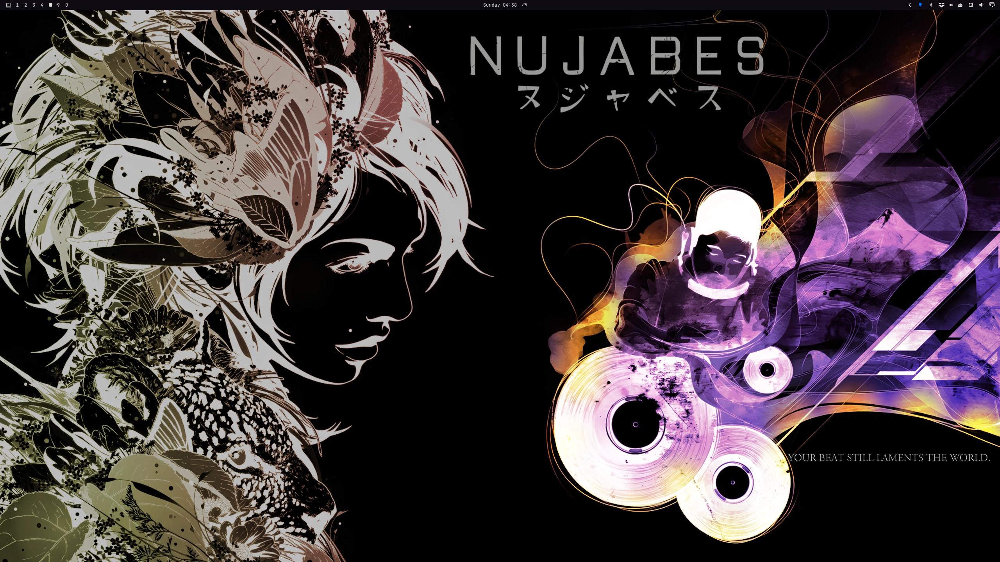
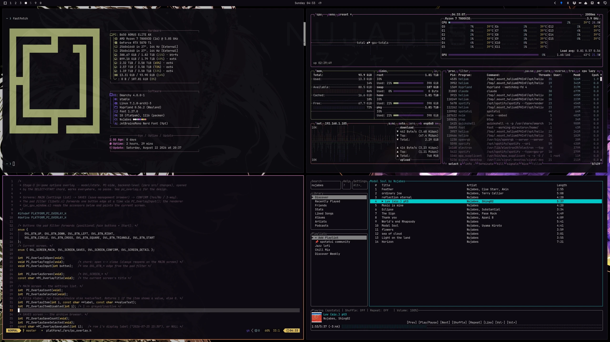
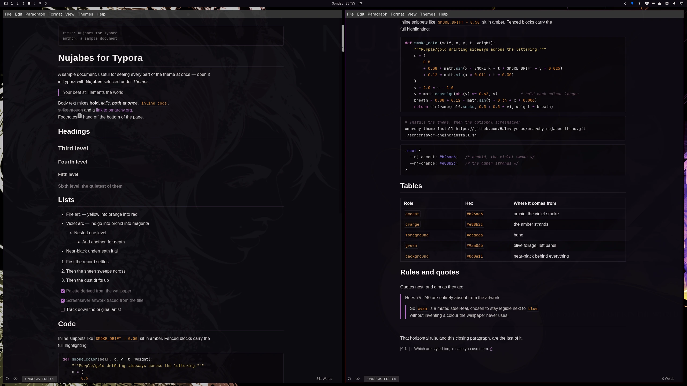
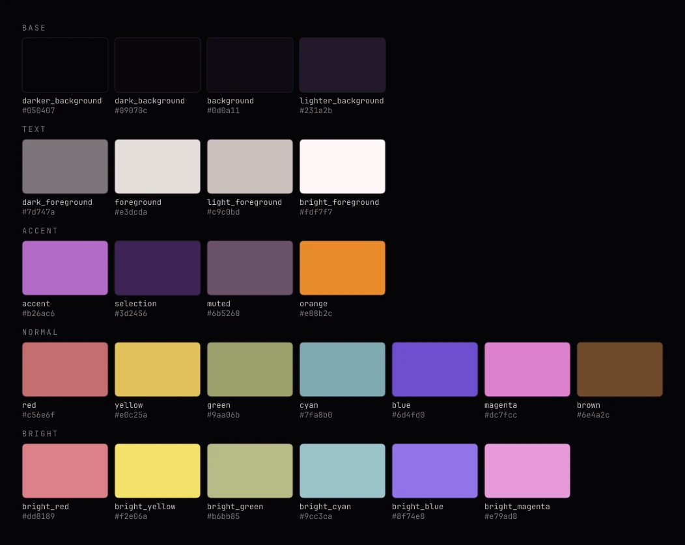
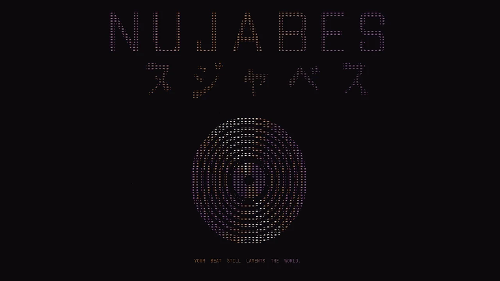

# 🎧 Nujabes Theme for Omarchy

A dark theme for [Omarchy](https://omarchy.org).
Violet smoke and amber strands over near-black, plus an animated screensaver built from the same artwork.

> _"Your beat still laments the world."_

## Previews

#### Background



#### Terminal and TUI



#### Typora

`typora/nujabes.css` themes [Typora](https://typora.io) to match.



```bash
cp typora/nujabes.css ~/.config/Typora/themes/
```

Restart Typora, then pick **Nujabes** under *Themes*. Mind the `themes/` subdirectory, and note that Typora only reads themes at startup.
`typora/sample.md` shows every element the stylesheet touches.


## Color Palette




## Installation

```bash
omarchy theme install https://github.com/HalmyLyseas/omarchy-nujabes-theme.git
```


## Screensaver

Optional, and installed separately from the theme.

[](./assets/screensaver-sample.mp4)

_Click through for an 8-second recording._

#### Install

```bash
./screensaver-engine/install.sh
```

It installs the renderer and appends a `PATH` block to
`~/.config/hypr/hyprland.lua` (backing the file up first) — that shadowing is the only place Omarchy's screensaver can be overridden. It runs only for themes shipping a `screensaver/` directory, so every other theme falls through to the stock one.

#### Uninstall

```bash
./screensaver-engine/uninstall.sh
```


## Repo layout

| Path | Purpose |
| --- | --- |
| `colors.toml` | The palette. Everything else is generated from it. |
| `backgrounds/` | Desktop wallpaper. |
| `preview.png` | Thumbnail for the theme switcher. |
| `icons.theme` | Icon theme name. |
| `screensaver/` | Artwork for the optional screensaver. |
| `screensaver-engine/` | The renderer that draws it. Not used by the theme itself. |
| `typora/` | Typora stylesheet. Installed separately, see above. |
| `assets/` | Screenshots and the palette image. |


## Maintaining this theme

Notes for changing it rather than installing it. How the pieces fit together, constraints that are not obvious, how to regenerate the artwork, and a release checklist are in [`docs/MAINTENANCE.md`](./docs/MAINTENANCE.md).

## Licence

MIT — see [`LICENSE`](./LICENSE).

The wallpaper is my own montage, assembled in GIMP, but it is built on two pieces of existing artwork that are not mine:

- the album cover for *Kaleidoscope* by DJ Okawari
- *Flowm*, tribute artwork by Romain Jacquet-Lagrèze

[`NOTICE.md`](./NOTICE.md) spells out what is and is not mine to license, and how to reach me if the artwork is yours.

## Credits

Nujabes was the stage name of Jun Seba (1974–2010). This theme is unofficial fan work named in tribute, and is not affiliated with his estate or any rights holder in his music.

The palette, the braille lettering and the screensaver artwork are all derived from the wallpaper.
